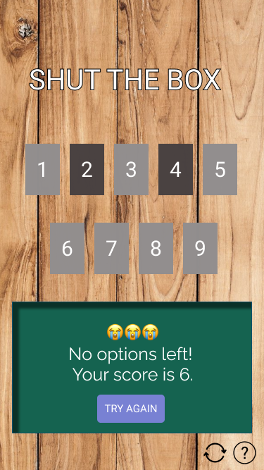

# SHUT THE BOX GAME
[Link to game](https://angharadcaswell.github.io/shut-the-box/)

# 1. Project Goals
Build an application to play Shut the Box game online.
# 2. User Experience

## 2.1 User Stories 
1. As a user, I want to be able to play “Shut the Box on my phone and desktop. 
2. As a user, I want to be taught how to play the game.
3. As a user, I want to feel excited when I win the game. 
4. As a user, I want to be able to refresh the game at any point. 
5. As a user, I want the game to be appealing and easy to use. 
6. As a user with impaired vision, I need the game to work with a screen reader. 
7. As a user, I want to be able to navigate easily between the homepage and the help page. 
8. As a user, I would like to see my final score.

## 2.2 Design

The physical game of Shut the Box is a wooden box with numbered pegs. The user physically closes the pegs until all of the box is closed. 

## How the physical game looks:

The application needs to recreate this idea of closing the box. The design shouldn't distract from the game and complicate the experience for the user. 

### Font 
The font used throughout the game is [Raleway](https://fonts.google.com/specimen/Raleway?query=raleway). This was choosen because it is clear, attractive and easy to read. 

### Color Scheme

To recreate the physical game online I have used similar colors to the actual box. The background of the body throughout the application is wooden. The cards is an woody brown color to fit the theme of the game. 

The color of the dice area is #156350 to recreate the area where you would through the dice in the real world. 

### Logo

I created a logo that is a simple line drawing of an open box with the title of the game.

### Audio 

## 2.3 Wireframes

|    Desktop   |    Tablet    |    Mobile    |
|    :----:    |     :----:   |    :----:    |
|[Home Page](wireframes/home_desktop.png)|[Home Page](wireframes/home_tablet.png)|[Home Page](readmeimages/home-mobile.png)

## Other states of play:

### Game complete:

### Wrong selection made:

### Play runs out of cards to close (end of game):

### Help page:
