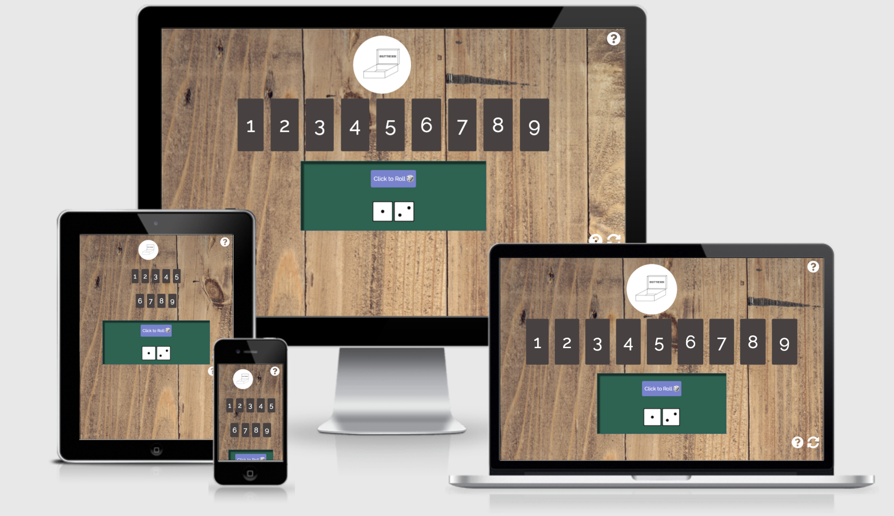
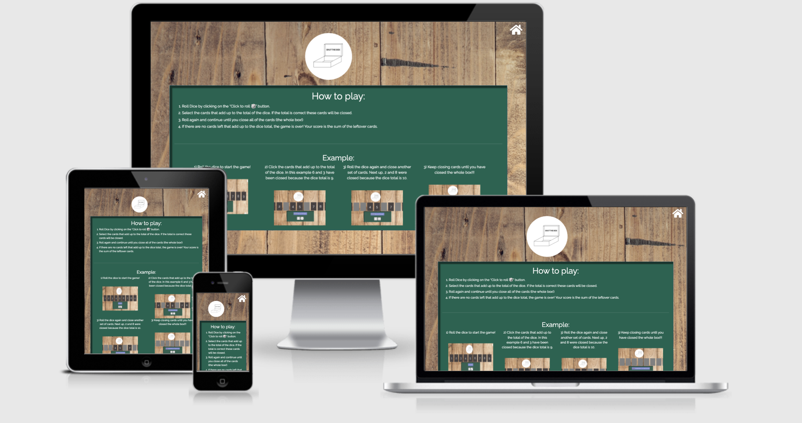
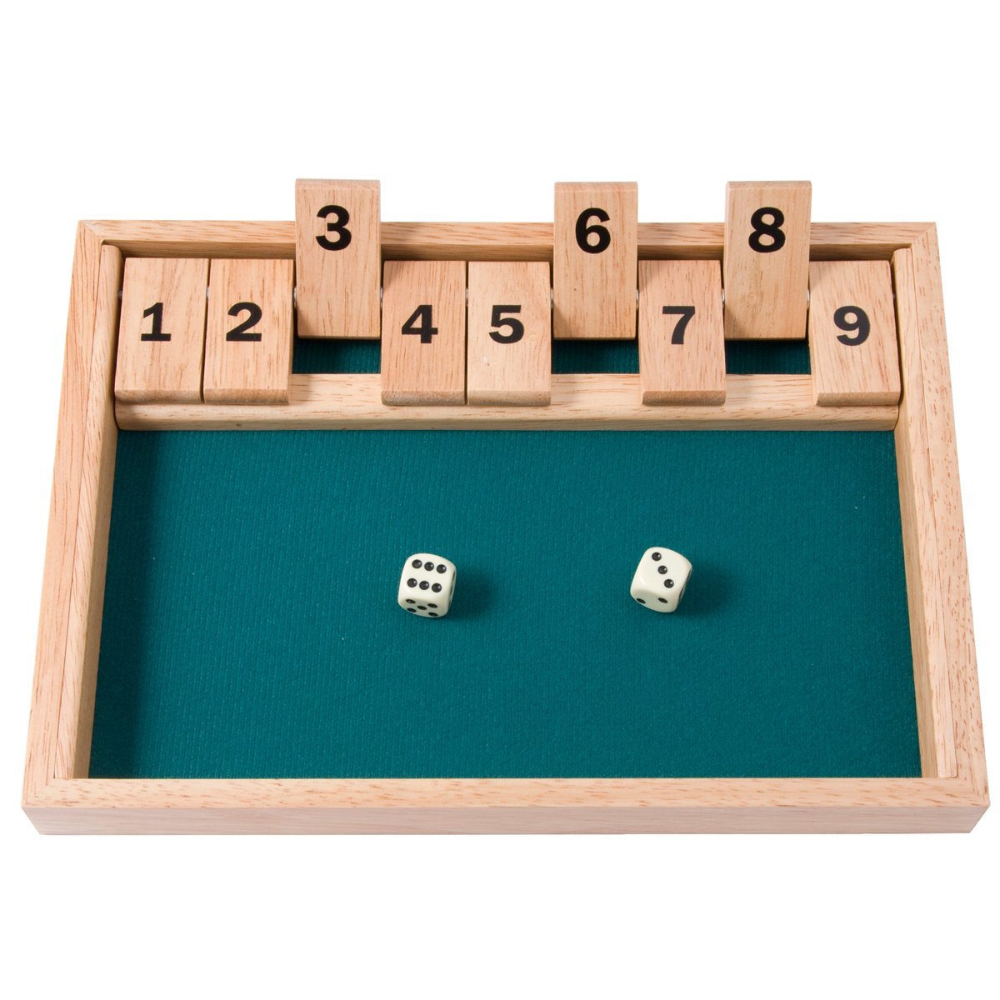
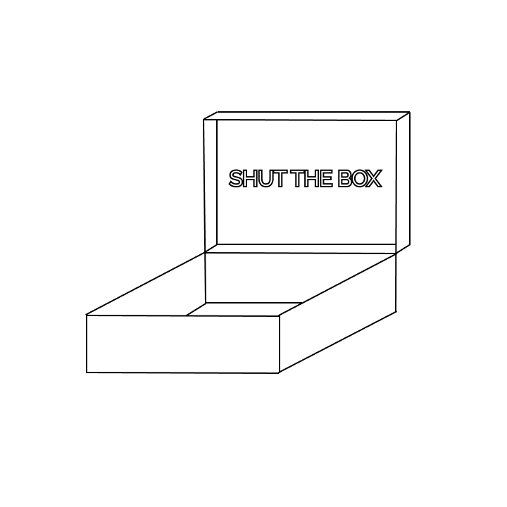
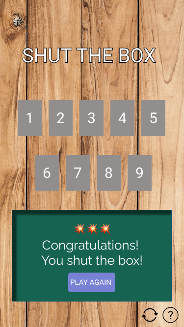
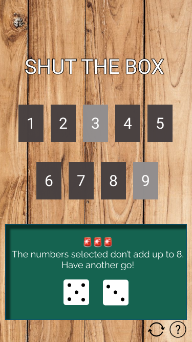
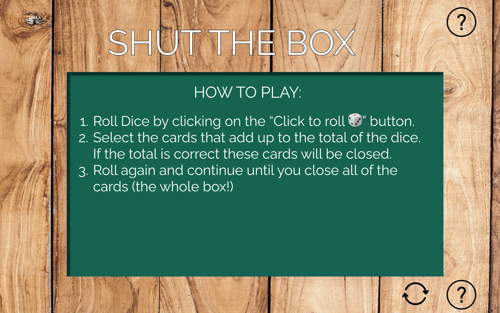
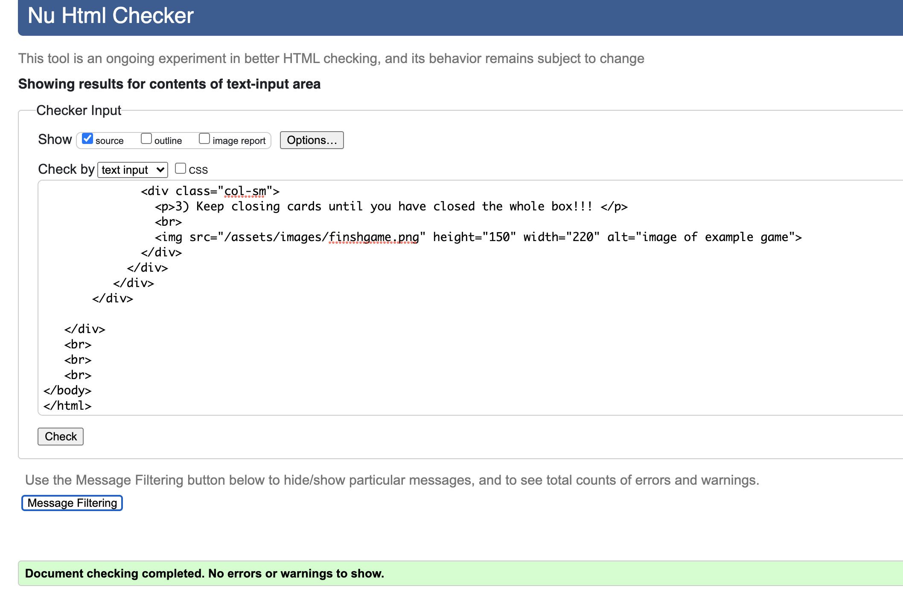
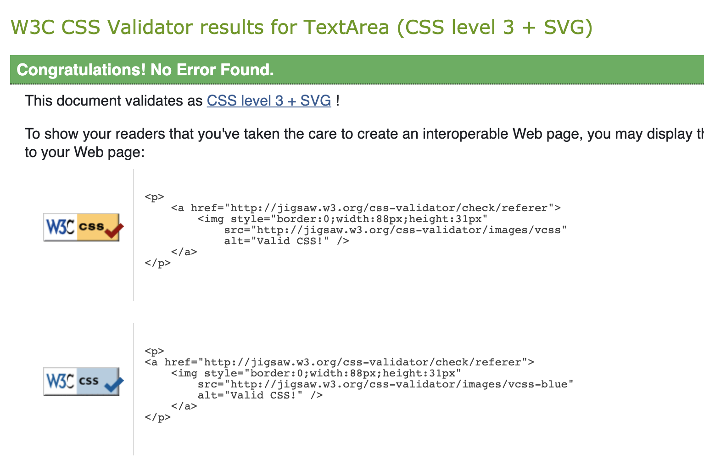
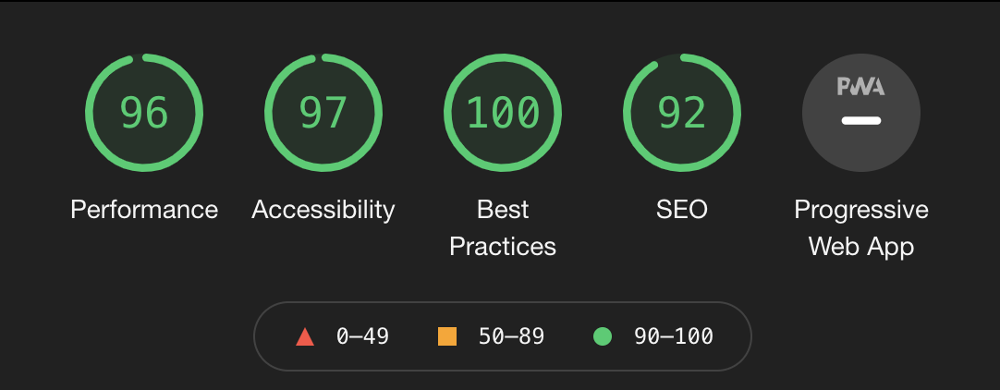

# SHUT THE BOX GAME
[Link to game](https://angharadcaswell.github.io/shut-the-box/)

# 1. Project Goals
Build an application to play Shut the Box game online.
# 2. User Experience

## 2.1 User Stories 
1. As a user, I want to be able to play “Shut the Box on my phone and desktop. 
2. As a user, I want to be taught how to play the game.
3. As a user, I want to feel excited when I win the game. 
4. As a user, I want to be able to refresh the game at any point. 
5. As a user, I want the game to be appealing and easy to use.  
6. As a user, I want to be able to navigate easily between the homepage and the help page. 

## 2.2 Design

The physical game of Shut the Box is a wooden box with numbered pegs. The user physically closes the pegs until all of the box is closed. 

## How the physical game looks:

The application needs to recreate this idea of closing the box. The design shouldn't distract from the game and complicate the experience for the user. 

### Font 
The font used throughout the game is [Raleway](https://fonts.google.com/specimen/Raleway?query=raleway). This was choosen because it is clear, attractive and easy to read. 

### Color Scheme

To recreate the physical game online I have used similar colors to the actual box. The background of the body throughout the application is wooden. The cards is an woody brown color to fit the theme of the game. 

The color of the dice area is #156350 to recreate the area where you would through the dice in the real world. 

### Logo

I created a logo that is a simple line drawing of an open box with the title of the game.

## 2.3 Wireframes

|    Desktop   |    Tablet    |    Mobile    |
|    :----:    |     :----:   |    :----:    |
|[Home Page](readmeimages/desktop-home.png)|[Home Page](readmeimages/tablet-home.png)|[Home Page](readmeimages/home-mobile.png)

## Other states of play:

### Game complete:

### Wrong selection made:

### Help page:

# 3. Features

## 3.1 All features

1. Homepage
* Where the game is played
* Link to help page
* Link to refresh game
2. Dice roll area
* Button to roll dice
3. Card flip area
* 9 cards to be clicked and "closed" by the user 
4. Help page
* "How to play" rules and example of game with images.
5. Refresh button
* Button to restart the game without finishing the game.
6. Shut the Box logo

## 3.2 Features to implement:
1. 2 player game
2. Play against the computer
3. Scoreboard and user name
4. Computer to calculate when the user has lost.

# 4. Technologies used 
* [HTML5](https://en.wikipedia.org/wiki/HTML5) - Content and structure
* [CSS](https://en.wikipedia.org/wiki/CSS) - Style my website
* [Javascript](https://en.wikipedia.org/wiki/JavaScript) - JavaScript
* [Gitpod](https://www.gitpod.io/) - Coding workspace
* [Github/ Github pages](https://github.com/)- Commit and deploy my code
* [Bootstrap](https://getbootstrap.com/) - Responsive grids
* [WebAim](https://webaim.org/resources/contrastchecker/) - Color contract check
* [Figma](https://www.figma.com/about/) - Design wirframes and prototypes
* [Font Awesome](https://fontawesome.com/) - Embed icons.
* [Google Fonts](https://fonts.google.com/) - Select and embed fonts
* [Am I responsive?](http://ami.responsivedesign.is/#)- To see display the website as mock ups  

# 5. Testing 

## Code test:
### Used [W3C HTML validator](https://validator.w3.org/#validate_by_input) to check HTML content.

### Used [W3C CSS Validator](https://jigsaw.w3.org/css-validator/#validate_by_input) to test CCS stylesheet.

### Used [JSHint Javascript Validator](https://jshint.com/) to test Javascript.

## Design test: 
### Lighthouse in Devs tools to check fonts and colors are accessible. 

## Browser test: 
### I have checked the application works in browsers: Chrome, Firefox, Safari.

## User Story:
###  [User stories with screenshots](user-story.md)

## 6. Deployment

How I deploy to Github pages for the first time:

Go to [GitHub.com](Github.com)

1. Log into Github account

2. Click on ‘Repositories’

3. Click on 'shut-the-box'

4. Click on ‘Settings’

5. Go to ‘Github Pages’ section.

6. Under the ‘Source’ select ‘Master Branch’. Then click 'save'

7. Refresh page and scroll to 'Github pages' and you will find a link has been created. The websit is deployed.

More information on how to deploy to Github pages can be found [here](https://docs.github.com/en/pages/getting-started-with-github-pages/configuring-a-publishing-source-for-your-github-pages-site).

To clone the site:

1. Select the 'shut-the-box' repository.
2. Click on ‘Clone or download’
3. Click on the clipboard icon
4. Open repo or create new repo
5. Open terminal
6. Type git clone and paste URL link and press enter.

$ git clone https://github.com/YOUR-USERNAME/YOUR-REPOSITORY

## 7. Credits

## Media
* Background image - Photo by FWStudio from Pexels
* Celebration Sounds - https://mixkit.co/free-sound-effects
* Wood Sounds - https://samplefocus.com/
* Dice Sounds - SoundSearcher

## Acknowledgments:
* My mentor [Precious](https://www.linkedin.com/in/precious-ijege-908a00168/?originalSubdomain=ng) for your help and guidance. 
* [Code Institute](https://codeinstitute.net/) student support, slack community and tutorials. 

