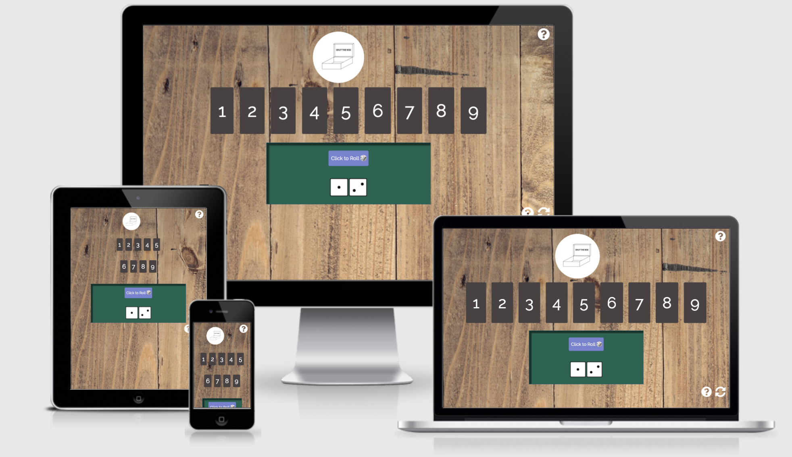

# User Stories Test:

## As a user, I want to be able to play “Shut the Box on my phone and desktop. 

## As a user, I want to be taught how to play the game.

### The application has a "How to play" page that can be accessed from the homepage. There are simple instructions and example images of the game.

## As a user, I want to feel excited when I win the game.

### When the user closes all of the cards (the box) they will recieve a congratulatory message. 

## As a user, I want to be able to refresh the game at any point.

### The user can refresh the game by pressing the button on the homepage.

## As a user, I want the game to be appealing and easy to use. 

### The application has a simple layout that is not distracting. It is also kept within the theme of the wooden box.

## As a user, I want to be able to navigate easily between the homepage and the help page. 

### There are links between the homepage and the help page. They are easily accessed at the top of the page.

